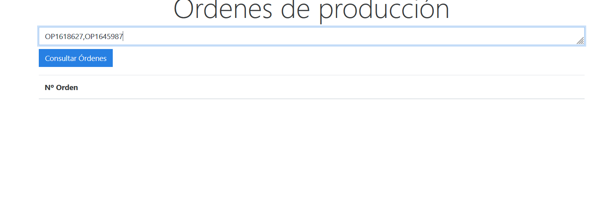
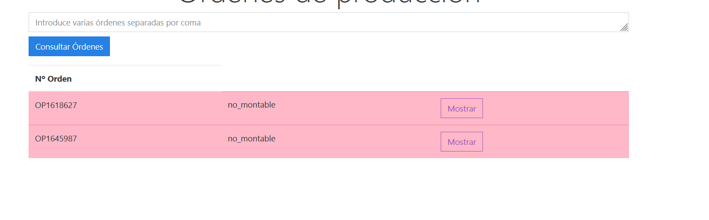
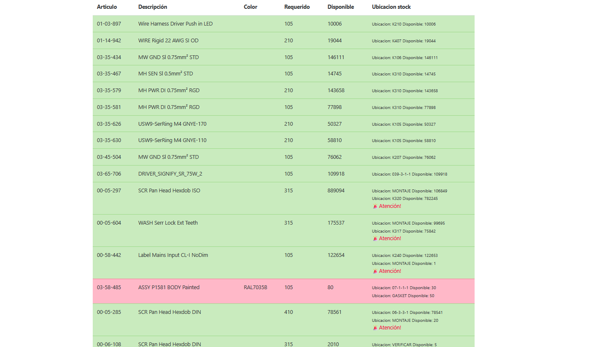

# 📦 Gestor de Stock por Órdenes

Aplicación web desarrollada con **Python** y **Flask** que permite consultar el estado de diferentes órdenes de producción y verificar si los artículos necesarios están disponibles en el stock.

La aplicación funciona a partir de un `.csv` con stock y artículos simulados, y un `.json` con números de órdenes ficticias y sus requerimientos.

Este proyecto ha sido desarrollado de forma **autodidacta** como parte de mi aprendizaje práctico, aplicando conocimientos reales en desarrollo web backend.

---

## 🎯 Funcionalidades

- Consulta de múltiples órdenes introducidas manualmente.
- Análisis de disponibilidad de stock por artículo.
- Estado visual de cada orden: ✅ montable, ⚠️ dudosa, ❌ no montable o desconocida.
- Vista detallada por orden con cantidades, ubicaciones y alertas visuales.
- Botón "Volver" que mantiene la consulta anterior activa.
- Estilo visual limpio con **Bootstrap** (tema Cosmo).

---

## 🛠 Tecnologías utilizadas

- Python 3.11  
- Flask  
- HTML5 + Jinja2  
- Bootstrap (Bootswatch Cosmo)  
- JSON + CSV para datos simulados

---

## 🖥️ Capturas de pantalla

### 📌 Pantalla de consulta inicial

### 📌 Consulta de varias órdenes a la vez

### 📌 Resultado de consulta

### 📌 Detalle de una orden

---

## ⚙️ Cómo ejecutar el proyecto

> Asegúrate de tener Python 3.11 (o superior) instalado.

### 1. Clona el repositorio

git clone https://github.com/tu-usuario/gestor-stock-ordenes.git
cd gestor-stock-ordenes

### 2. Creacion y activación del entorno virtual

python -m venv venv

> En Windows
venv\Scripts\activate
> En Mac/Linux
source venv/bin/activate

### 3. Instala las dependencias

pip install -r requirements.txt

### 4. Datos simulados

Las ordenes de produccion simuladas se encuentran en el archivo:
ordenes.json
{
"OP1618627": [...],
"OP1645987": [...]
}

### 5. Ejecuta la aplicación

En la terminal, desde la **carpeta raíz del proyecto**, ejecuta:

python main.py

Esto iniciará el servidor local de Flask:
👉 http://localhost:5000

🙋‍♀️ Autor

Desarrollado por María Padrino
💼 LinkedIn www.linkedin.com/in/mariapguerra89
 • 📧 mariapg289@gmail.com
